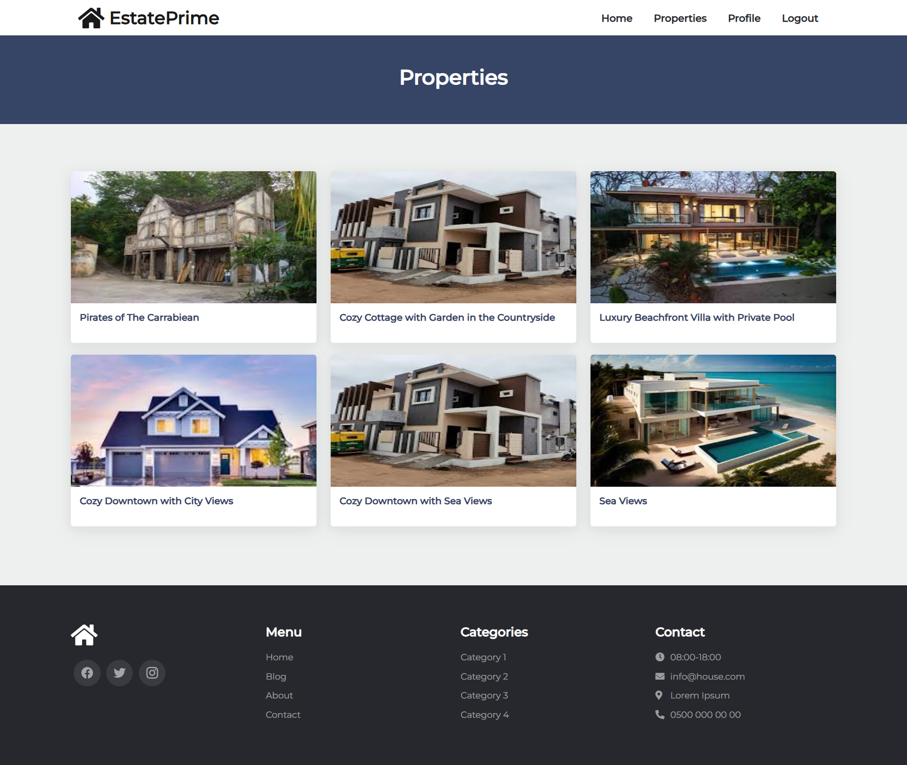
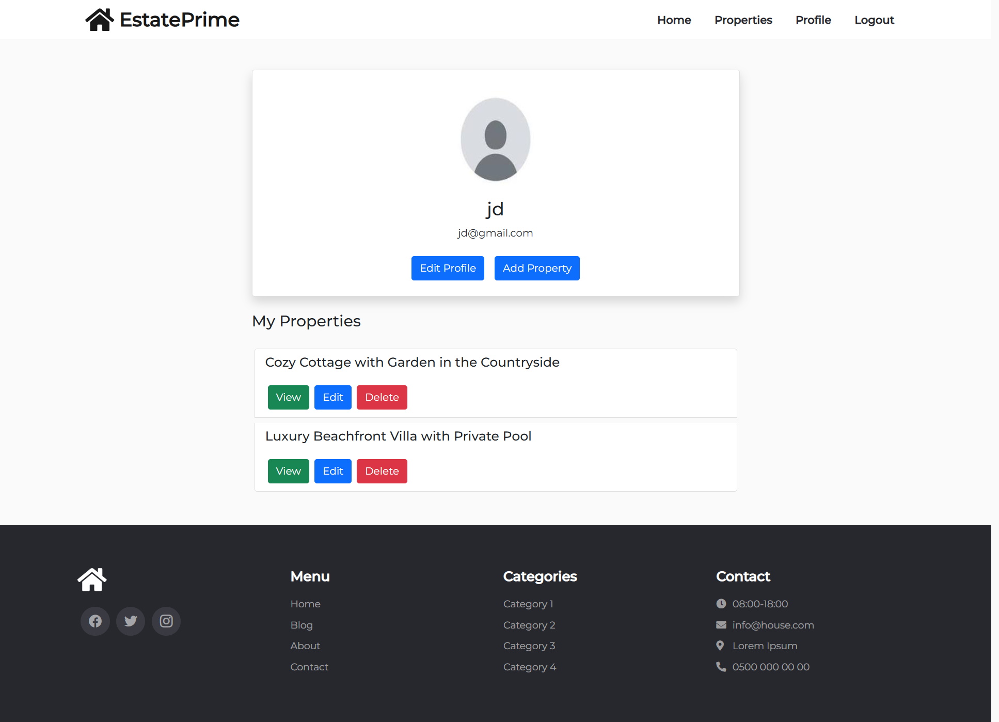
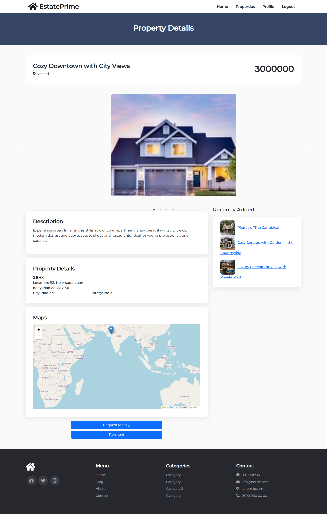

# Real Estate MERN Application

## Overview
A full-stack real estate application built with the MERN stack. It enables users to list, search, and manage properties with a modern and responsive interface.

## Homepage

## List Properties

## User Profile

## Property Details


## Features
- **Property Listings**: Browse, search, and filter real estate listings.
- **Property Management**: Admins can add, edit, and manage property listings.
- **Responsive Design**: Optimized for mobile and desktop devices.

## Installation

1. **Clone the repository**:
   ```bash
   git clone https://github.com/Dharmik090/real-estate-mern.git

2. **Backend Setup**:

Navigate to the backend directory:
      ```bash
      cd real-estate-mern/backend
Install the backend dependencies:
      ```bash
      npm install
Change database url in /config/dbConnector.js
Start the backend server:
      ```bash
      npm start

3. **Frontend Setup**:

Open a new terminal and navigate to the client directory and install frontend dependencies:
      ```bash
      cd ../frontend
      npm install
Start the React application:
      ```bash
      npm start

4. **Access the Application**:
Open your browser and go to http://localhost:5000 to view the app.